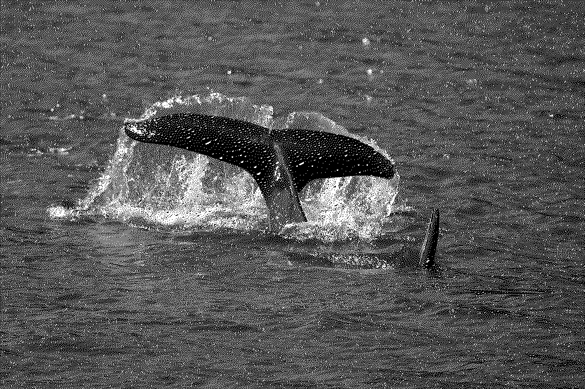
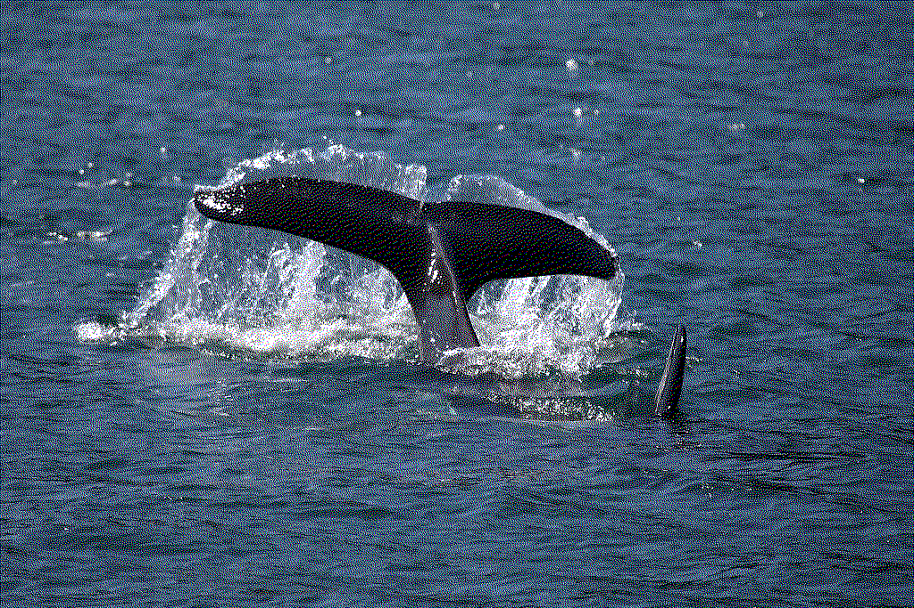

# Rusticate

Rusticate is a simple image dithering tool written in Rust.

## About

The project is capable of converting any given image into 1-bit grayscale or color image using Floyd–Steinberg dithering.

## Usage

To use the tool, pass in the path of the input image, the path where you want the output image to be saved, and an optional flag to specify whether you want the output image to be grayscale or in color.

Here's how to use it:

```rusticate --grayscale /path/to/input.jpg /path/to/output.jpg```

This will read `input.jpg`, perform grayscale dithering, and write the result to `output.jpg`.

If you omit the `--grayscale` flag, the program will perform color dithering.

## Examples

Image from [Kenai Fjords National Park](https://www.flickr.com/photos/89251484@N06/8204079962).





## Dependencies

This project depends on the `image` and `structopt` crates.

## License

This project is licensed under the MIT License.
